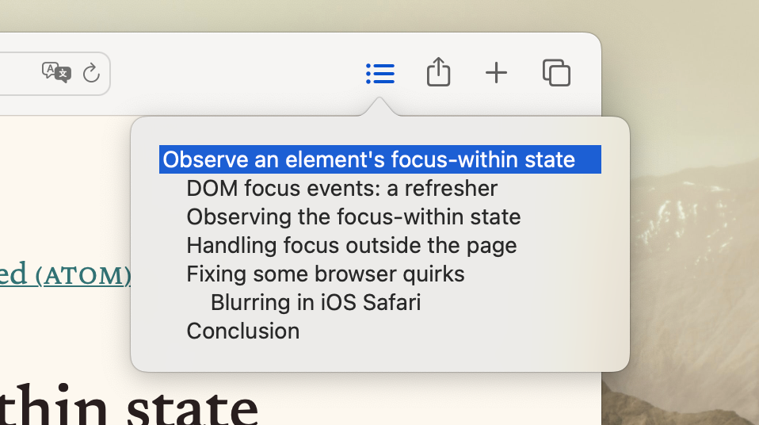

# Table of contents

<b>Table of contents</b> is a browser extension for quickly navigating documents, available for Safari (macOS and iOS) and Firefox.

In any web page with sections (an article, a documentation page, etc), summon Table of contents to see a list of all headings in the page. Select any to jump to it instantly.

In the desktop version, the list supports click-and-drag selection, arrow key navigation, and type-to-select. You can also invoke the list by pressing ⌃G (macOS) or Control-Q (Linux, Windows).

<table>
	<tr>
		<td>
			For Safari (macOS and iOS)
		</td>
		<td>
			
			&nbsp;
			<a href="https://apps.apple.com/us/app/table-of-contents-for-safari/id1665115607">
				Download from the App Store
			</a>
		</td>
	</tr>
	<tr>
		<td>
			For Firefox (macOS, Linux, Windows)
		</td>
		<td>
			
			&nbsp;
			<a href="https://addons.mozilla.org/addon/table-of-contents/">
				Download from addons.mozilla.org
			</a>
		</td>
	</tr>
</table>

### Using TOC faster on the desktop

With the mouse, you can click-and-drag the list to quickly scan through headings.

On the keyboard:
<table>
<tr>
	<td align=right><code>⌃G</code></td><td>Show Table of contents</td>
</tr>
<tr>
	<td align=right><code>↑</code>, <code>↓</code></td><td>Navigate through headings</td>
</tr>
<tr>
	<td align=right><code>⌥↑</code>, <code>⌥↓</code></td><td>Jump to top/bottom of list</td>
</tr>
<tr>
	<td align=right>Type a word</td><td>Jump to heading starting with that word</td>
</tr>
</table>
