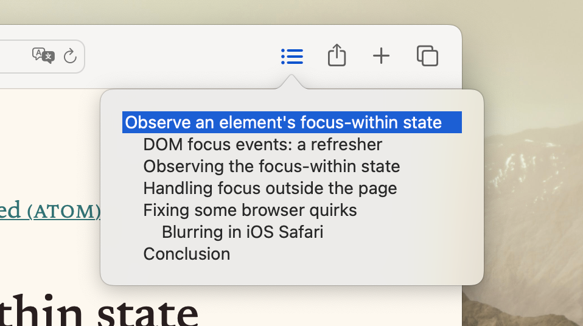

# Table of contents

<b>Table of contents</b> is a Safari extension for quickly navigating documents.

In any web page with sections—an article, a documentation page, etc—summon Table of contents to see a list of all headings in the page. Click any to jump to it instantly.  
The list supports click-and-drag selection, arrow key navigation, and type-to-select. You can also invoke the list by pressing ⌃G.

Download <a href="https://apps.apple.com/us/app/table-of-contents-for-safari/id1665115607">Table of contents on the Mac App Store</a>.

### Using TOC faster

With the mouse, you can click-and-drag the list to quickly scan through headings.

With the keyboard, you can invoke Table of contents with ⌃G, then use the up and down arrows to navigate.  
Use ⌥↑ and ⌥↓ to jump to the top and bottom of the list. Start typing the beginning of a heading's name to jump to it.
